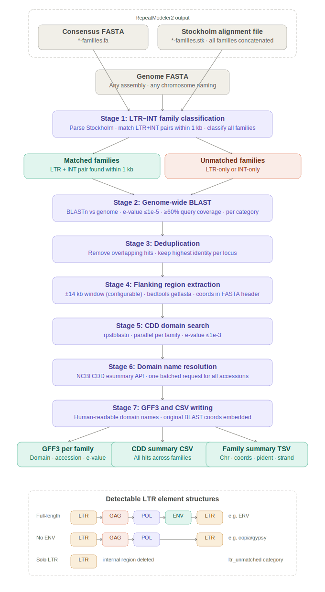

# LAMP: LTR Annotation and Mining Pipeline

A single-script pipeline for identifying and characterising LTR retrotransposons and endogenous retroviruses (ERVs) in genome assemblies. Shining a light on the [RepeatModeler2](https://github.com/Dfam-consortium/RepeatModeler) output, the pipeline classifies repeat families by structural completeness, maps insertion sites genome-wide, annotates flanking regions with conserved retroviral protein domains (Gag, Pol/RT, Integrase, Env), and produces per-family GFF files ready for inspection in Geneious or any genome browser.

---

## Overview

Full-length ERVs have a characteristic structure: **LTR — GAG — POL — ENV — LTR**. RepeatModeler2 models LTR and internal (INT) domains as separate families. This pipeline:

1. Parses the RepeatModeler2 Stockholm alignment file to identify which LTR families have a co-located INT partner (within 1 kb) — these are candidates for full-length elements
2. Classifies all families into **matched** (LTR+INT pair found) or **unmatched** (LTR-only or INT-only)
3. BLASTs each category's consensus sequences against the genome to find all insertion sites
4. Deduplicates overlapping BLAST hits, keeping the highest-identity hit per locus
5. Extracts flanking regions (default ±14 kb) around each hit and runs `rpstblastn` against the NCBI Conserved Domain Database (CDD) to detect retroviral protein domains
6. Maps CDD accession numbers to human-readable domain names (e.g. `RVT_1`, `Gag_p24`, `rve`, `ENV`) via a single batched NCBI API query
7. Writes per-family GFF3 files with domain name, accession, e-value, and the original BLAST hit coordinates embedded as attributes

---

## Pipeline overview



---

## Dependencies

All tools must be available on your `PATH`.

| Tool | Version tested | Purpose |
|---|---|---|
| `bash` | ≥ 4.0 | Pipeline execution |
| `python3` | ≥ 3.7 | Stockholm parsing, NCBI API query |
| `blastn` / `makeblastdb` | BLAST+ ≥ 2.12 | Genome-wide LTR insertion site search |
| `rpstblastn` | BLAST+ ≥ 2.12 | CDD domain annotation of flanking regions |
| `samtools` | ≥ 1.15 | Genome FASTA indexing |
| `bedtools` | ≥ 2.30 | Flanking region extraction |
| `gawk` | ≥ 5.0 | Coordinate arithmetic, deduplication, GFF writing |

Python standard library only — no third-party packages required.

Internet access is required for one step only: the NCBI CDD esummary API call that resolves accession numbers to domain names. If your compute nodes lack outbound internet access, the pipeline will still complete and raw accession numbers (e.g. `gnl|CDD|47234`) will appear in GFF outputs in place of readable names.

### CDD Database

Download the legacy CDD (RPS-BLAST format) from NCBI:

```bash
wget https://ftp.ncbi.nih.gov/pub/mmdb/cdd/little_endian/Cdd_LE.tar.gz
tar -xzf Cdd_LE.tar.gz
# Results in a directory containing Cdd.rps, Cdd.loo, Cdd.aux etc.
```

Pass the directory (not the file stem) as the `cdd_db_dir` argument — the pipeline auto-detects the `.rps` stem.

---

## Installation

```bash
git clone https://github.com/yourusername/lamp.git
cd lamp
chmod +x LAMP.sh
```

No compilation or environment setup is needed beyond the dependencies above.

---

## Usage

```bash
bash LAMP.sh <genome_fasta> <query_ltrs_fasta> <stockholm_file> <cdd_db_dir> [flank_size]
```

### Arguments

| Argument | Required | Description |
|---|---|---|
| `genome_fasta` | Yes | Genome assembly FASTA (any chromosome count or naming convention) |
| `query_ltrs_fasta` | Yes | RepeatModeler2 consensus FASTA (`*-families.fa`) |
| `stockholm_file` | Yes | RepeatModeler2 Stockholm alignment file (`*-families.stk`) |
| `cdd_db_dir` | Yes | Directory containing the CDD RPS-BLAST database files |
| `flank_size` | No | Flanking region size in bp around each BLAST hit (default: `14000`) |

### Example

```bash
bash LAMP.sh \
    genome_assembly.fasta \
    RM_output/genome-families.fa \
    RM_output/genome-families.stk \
    /path/to/Cdd \
    14000
```

### Parallel jobs

The number of simultaneous `rpstblastn` jobs is set near the top of the script:

```bash
CDD_PARALLEL_JOBS=8
```

Each job uses 4 internal threads, so total thread usage during the CDD step is `CDD_PARALLEL_JOBS × 4`. Adjust to suit your system.

---

## Inputs

The pipeline expects the direct output of a RepeatModeler2 run:

- **`*-families.fa`** — consensus sequences for all modelled repeat families
- **`*-families.stk`** — Stockholm-format multiple alignments for all families (single concatenated file)

RepeatModeler2 can be run as:

```bash
BuildDatabase -name genome_db genome_assembly.fasta
RepeatModeler -database genome_db -LTRStruct -pa <threads>
```

The `-LTRStruct` flag is required to produce separate LTR and INT family models, which this pipeline depends on.

---

## Outputs

All outputs are written to a timestamped directory: `<genome_basename>_RM_pipe_<YYYYMMDD_HHMMSS>/`

### Classification outputs

| File | Description |
|---|---|
| `matched_families_yes.txt` | Family IDs with at least one LTR–INT pair identified |
| `matched_families_no.txt` | Family IDs with no LTR–INT pair |
| `family_match_results.csv` | Family-level LTR→INT match pairs |
| `ltr_int_matches.csv` | Sequence-level LTR–INT pair details (coordinates, strand) |
| `all_ltr_int_sequences.csv` | All sequences with `Matched=Yes/No` column |

### BLAST outputs

| File | Description |
|---|---|
| `all_hits_combined.txt` | Raw BLAST results from all three categories, tagged |
| `all_hits_deduplicated.txt` | After removing overlapping hits (highest pident kept) |
| `all_hits_removed_duplicates.txt` | Hits that were replaced during deduplication |
| `*_blast_extended_sorted.txt` | Per-category hits with strand column, sorted |

### Flanking region and domain outputs (per category: `ltr_matched`, `ltr_unmatched`, `int_unmatched`)

| File | Description |
|---|---|
| `*_flank_<N>bp.bed` | BED coordinates of flanking windows |
| `*_flank_<N>bp.fa` | Extracted flanking sequences |
| `*_cdd_summary.csv` | All CDD hits: family, region, domain name, accession, e-value, coordinates |
| `*_family_sequences_summary.tsv` | Per-hit summary: family, chromosome, coordinates, orientation, BLAST stats |
| `cdd_name_lookup.tsv` | Accession → domain name mapping (Title + Subtitle from NCBI) |

Per-family GFF3 files are written to `<genome_basename>_region_fastas/<category>/`:

```
*_cdd_hits.gff
```

Each GFF feature contains:

```
Name=RVT_1
DomainName=RVT_1
Description=Reverse transcriptase
Accession=gnl|CDD|47234
Evalue=3.4e-28
OriginalBlastHit=chr1:58200-59100(+)
```

The `OriginalBlastHit` attribute records the exact LTR BLAST hit coordinates before the flanking window was added, making it straightforward to identify which locus each domain annotation belongs to.

---

## How it works: three analysis categories

Families are split into three categories that are each BLASTed and annotated independently:

- **`ltr_matched`** — LTR families that have a co-located INT partner. These are the strongest candidates for full-length ERVs.
- **`ltr_unmatched`** — LTR families with no INT partner detected.
- **`int_unmatched`** — INT families with no LTR partner.

Identifying a full-length ERV requires finding a locus in `ltr_matched` whose flanking GFF shows all three domain classes: a Gag domain (e.g. `Gag_p24`, `Gag_MA`), a Pol domain (e.g. `RVT_1`, `rve`), and an Env domain (e.g. `TLV_coat`, `ENV`).

---

## Notes

- Sequences on scaffolds prefixed `NW_` are excluded from BLAST analysis (NCBI unplaced scaffold convention). Edit the `awk` filter in `run_blast_pipeline()` if your assembly uses a different naming scheme.
- Deduplication uses a 10 bp coordinate tolerance window; this can be adjusted in the `gawk` deduplication block.
- The BLAST e-value cutoff is `1e-5` with ≥60% query coverage. The CDD e-value cutoff is `1e-3` (permissive, to catch diverged retroviral domains).
- BLAST databases are cached in the output directory and reused if the script is re-run on the same genome.

---

## Citation

Currently only in pre-print:

Michie, CAG, et al. (2026) *bioRxiv* (2026): https://www.biorxiv.org/content/10.64898/2026.06.25.734490v1

If you use this pipeline in published work, please cite the dependencies it relies on:

- **RepeatModeler2**: Flynn JM et al. (2020) *PNAS* 117(17):9451–9457
- **BLAST+**: Camacho C et al. (2009) *BMC Bioinformatics* 10:421
- **BEDTools**: Quinlan AR & Hall IM (2010) *Bioinformatics* 26(6):841–842
- **SAMtools**: Danecek P et al. (2021) *GigaScience* 10(2):giab008
- **NCBI CDD**: Lu S et al. (2020) *Nucleic Acids Research* 48(D1):D265–D268

---

## Licence

MIT
